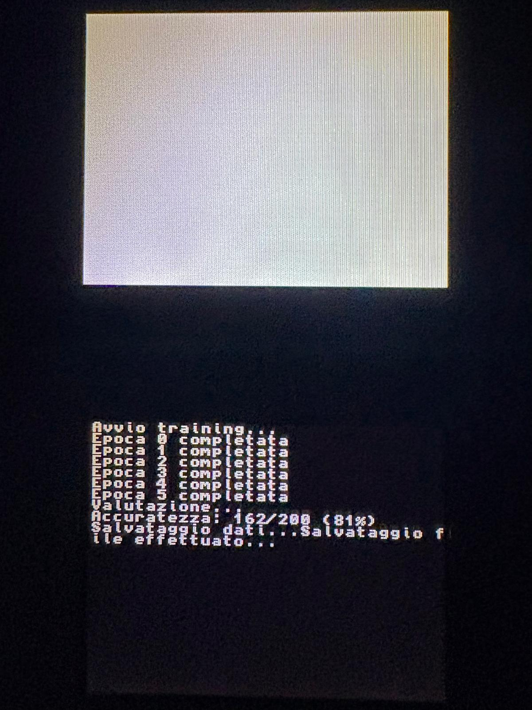

# nintendo-ds-single-layer-nn

Allenare una rete neurale a singolo strato, o **percettrone**, direttamente su un **Nintendo DS Lite**.

## Strumenti hardware

Per realizzare il progetto sono necessari i seguenti componenti:

- **Nintendo DS Lite** — il dispositivo sul quale verrà eseguito il programma di addestramento.
- **Scheda R4 compatibile con Nintendo DS Lite** — utilizzata per eseguire software homebrew e caricare il programma dalla microSD.
- **Scheda microSD** — utilizzata per memorizzare il software della R4, il programma homebrew e il dataset.
- **Lettore di schede microSD** — necessario per trasferire i file dal computer alla microSD.

> [!NOTE]
> La compatibilità tra Nintendo DS Lite, modello della R4 e relativo kernel/software è fondamentale. Prima di procedere è necessario identificare esattamente il modello della scheda R4 utilizzata.

## Scheda R4 e varianti del software

Le schede **R4** disponibili per Nintendo DS non utilizzano tutte lo stesso software. Nel corso degli anni sono state prodotte numerose varianti hardware, spesso accompagnate da firmware e kernel differenti.

Prima di configurare l'ambiente di sviluppo è quindi necessario:

1. **Identificare il modello esatto della R4** utilizzata.
2. Verificare quale **kernel/firmware** è compatibile con quel modello.
3. Installare sulla microSD la versione corretta del software.
4. Verificare che la R4 riesca ad avviare correttamente applicazioni **homebrew** sul Nintendo DS Lite.

La struttura finale della microSD dipenderà dal modello e dal software utilizzato.

> [!WARNING]
> Non è consigliabile utilizzare un kernel R4 trovato casualmente online. Modelli apparentemente identici possono richiedere versioni software differenti; l'utilizzo di un kernel incompatibile può impedire l'avvio della scheda.

Una volta verificata la compatibilità della R4, è possibile procedere con la configurazione dell'ambiente di sviluppo.

La versione del kernel/firmware per questo progetto è basata su YSMenu, adattata per card clone R4i (driver DLDI r4i.di), con struttura compatibile anche TTMenu.
## Impostazione dell'ambiente di lavoro

Poiché il **Nintendo DS** è una piattaforma ormai datata, configurare direttamente su un sistema moderno tutti gli strumenti necessari per sviluppare applicazioni homebrew può risultare complesso. Le versioni originali dei toolchain e delle relative dipendenze, infatti, non sono sempre facilmente reperibili o compatibili con i sistemi operativi attuali.

Per semplificare la configurazione dell'ambiente di sviluppo viene utilizzato **Docker**, che permette di raccogliere all'interno di un container tutti gli strumenti necessari per la compilazione del progetto.

L'immagine Docker utilizzata dal progetto è:

```text
nds-projects-nds
```

## Sistemazione del dataset

Visto la semplicità del percettrone, ho optato per un dataset semplice e tradizionale: **MNIST**, una raccolta di immagini raffiguranti numeri da `0` a `9` scritti a mano.

Per adattare il dataset alle risorse limitate del Nintendo DS Lite, ho utilizzato un computer esterno per ridurre il numero di immagini. Ho scelto di utilizzare un massimo di **500 immagini per ogni numero per il training** e **20 immagini per ogni numero per il testing**.

La scelta di questi valori è dovuta principalmente alle limitate risorse hardware del Nintendo, in particolare i **4 MB di RAM** e i **2 GB di memoria di archiviazione** disponibili.

Una volta selezionate le immagini, ho convertito ciascuna di esse in una sequenza di valori numerici corrispondenti ai singoli pixel. Le immagini originali di MNIST hanno una dimensione di **28 × 28 pixel**, quindi ogni immagine viene rappresentata da **784 valori**, uno per ciascun pixel.

I valori dei pixel sono compresi tra `0` e `255`, dove `0` rappresenta il nero e `255` il bianco.

Per semplificare la gestione del dataset direttamente sul Nintendo DS, ho quindi salvato i dati convertiti all'interno di file di testo, con i 784 valori di ogni immagine su una singola riga separati da spazio.

La struttura della microSD è la seguente:

```text
/array/outputTrain
├── output0.txt
├── output1.txt
├── output2.txt
├── output3.txt
├── output4.txt
├── output5.txt
├── output6.txt
├── output7.txt
├── output8.txt
└── output9.txt

/array/outputTest
├── outputTest0.txt
├── outputTest1.txt
├── outputTest2.txt
├── outputTest3.txt
├── outputTest4.txt
├── outputTest5.txt
├── outputTest6.txt
├── outputTest7.txt
├── outputTest8.txt
└── outputTest9.txt
```

`/output` contiene le 500 immagini per classe usate per il training, `/array/outputTest` le 20 immagini per classe usate per la valutazione finale.

Ad esempio, una riga del file può avere il seguente formato:

```text
0 0 0 0 0 0 0 0 0 18 0 0 1 8 1 1 0 0 ...
255 255 238 227 250 255 79 2 0 15 0 0 0 0 ...
0 0 0 0 0 0 130 ...
```

## Creazione del codice

Durante lo sviluppo ho dovuto tenere conto delle limitazioni hardware del **Nintendo DS Lite**. In particolare, i processori **ARM7** e **ARM9** del dispositivo non dispongono di un'unità hardware dedicata al calcolo in virgola mobile (*Floating Point Unit*, FPU).

Per questo motivo ho deciso di evitare l'utilizzo dei tipi `float` e `double` all'interno del programma, usando esclusivamente **tipi interi**: pesi, bias, pixel e score sono tutti `int`. L'SDK metterebbe a disposizione anche la virgola fissa (*fixed-point arithmetic*, per rappresentare valori frazionari scalando un intero, es. `0.75` → `750` con fattore di scala `1000`), ma alla fine non mi è servita: la regola di aggiornamento del percettrone converge anche con un learning rate intero pari a `1`, quindi ho potuto evitare del tutto la complicazione della virgola fissa.

Il codice viene successivamente compilato all'interno dell'ambiente Docker precedentemente configurato, utilizzando il toolchain per Nintendo DS, ottenendo infine il file eseguibile `.nds` che verrà trasferito sulla microSD e avviato tramite la scheda R4.

## Addestramento del percettrone

Il modello è composto da **10 percettroni paralleli**, uno per cifra (`0`-`9`), ciascuno con un vettore di 784 pesi e un bias. Per ogni immagine, ogni percettrone calcola uno score (somma pesata dei pixel più bias); la classe predetta è quella con lo score più alto (argmax). Se non coincide con la classe reale, i pesi vengono aggiornati con la regola classica del percettrone: rinforzati verso la classe corretta, indeboliti verso quella predetta erroneamente.

Invece di leggere tutte le 500 immagini di una classe e poi passare alla successiva, ad ogni epoca il programma alterna la lettura: legge una riga a turno da ciascuno dei 10 file (`output0.txt` ... `output9.txt`), un giro alla volta, finché tutti i file non sono esauriti. Questo evita che il modello "dimentichi" le classi viste all'inizio mentre si specializza sulle ultime lette in blocco.

Il training gira per **6 epoche**. Al termine viene eseguita una valutazione sulle 20 immagini per classe della cartella `/array/outputTest`, calcolando l'accuratezza come percentuale di predizioni corrette sul totale.

I pesi finali vengono salvati in `/pesi.bin` (formato binario, tramite `fwrite`), così da poterli eventualmente ricaricare in futuro con `carica_pesi()` senza dover rieseguire il training da zero.
## Risultati

L'accuratezza ottenuta dai percettroni sul dataset di testing è stata dell'**81%**, con **162 immagini classificate correttamente su 200**.

Il risultato è interessante considerando le risorse molto limitate del Nintendo DS Lite e il fatto che l'addestramento è stato effettuato direttamente sul dispositivo.

<p align="center">
  
</p>

## Fine

Questo progetto è nato e cresciuto poco alla volta, principalmente per interesse e curiosità personale.

Non vuole essere un progetto serio o una soluzione particolarmente efficiente: è stato realizzato semplicemente per passione e per il piacere di sperimentare.

L'obiettivo principale è stato quindi sperimentare, imparare qualcosa di nuovo e vedere fin dove fosse possibile spingersi con le risorse a disposizione.

In futuro, il progetto potrebbe evolversi in qualcosa di più complesso, magari introducendo nuove funzionalità o sperimentando algoritmi e approcci differenti.
